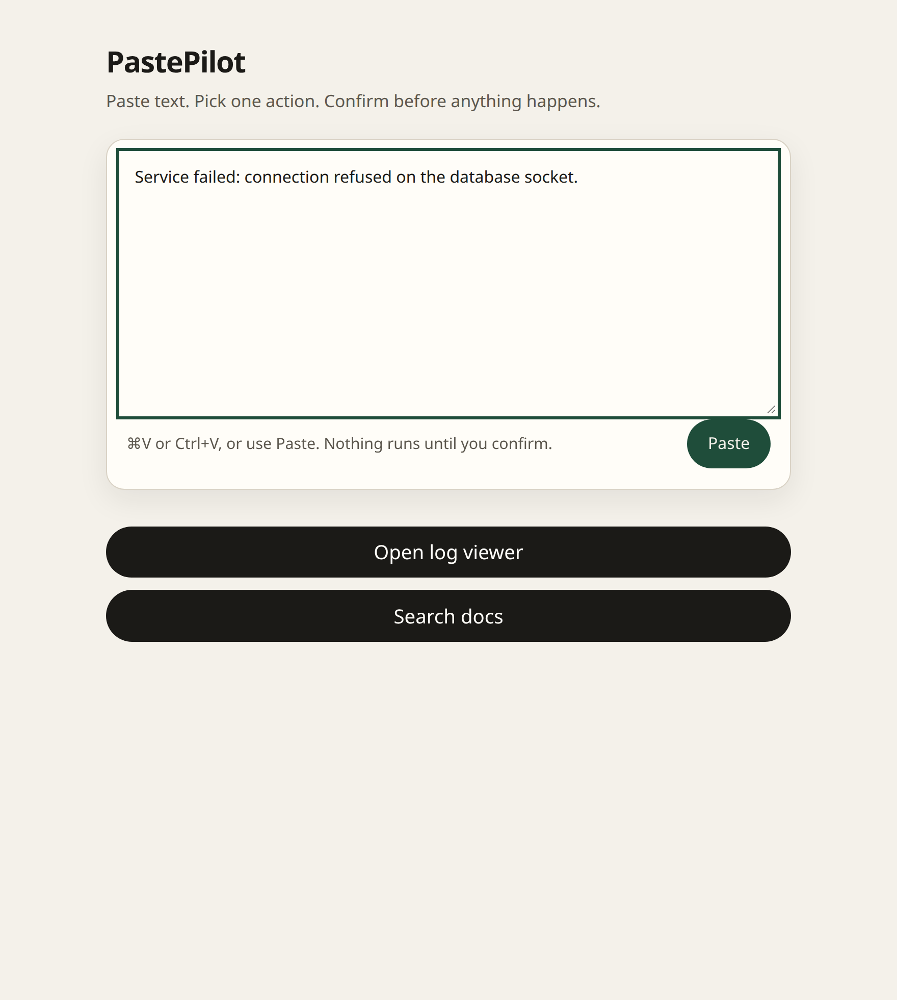
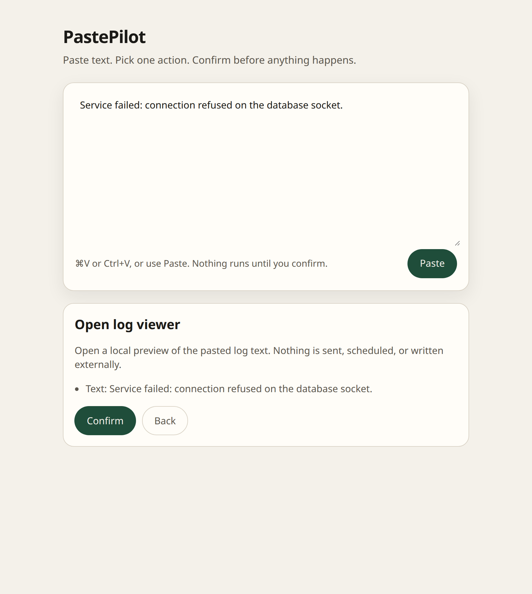

# PastePilot

Paste or share some text. Get a few useful actions. Confirm before anything happens.

<video src="docs/demo/pastepilot-core.mp4" controls playsinline muted width="720" title="PastePilot: paste text, pick an action, confirm">
</video>

[Watch the 9-second demo](docs/demo/pastepilot-core.mp4) — paste a log line → a few buttons → preview → Confirm. Nothing runs until you say so. The clip is silent and uses the offline mock (no API key).





PastePilot is a small launcher, not a chatbot. You give it text. It suggests at most three things you might do with that text. You pick one, read a short preview, and tap Confirm. Until then, nothing is sent, scheduled, or written.

## What it is

You paste (or Share) a log line, a meeting note, a link, or an idea. PastePilot offers a short list of allowlisted actions — for example **Open log viewer**, **Draft event**, or **Save idea**. Tap a button to see a preview. Confirm is still a local preview today: it does not send mail, write a calendar, or call an external API.

Routing is typed: a classifier picks from a fixed tool list. Exact dates, URLs, and emails are parsed in ordinary code and shown in the preview. They never invent a send or a schedule.

## Why it exists

Most “do something with this text” tools either chat at you or quietly act on a clipboard. PastePilot is the opposite.

- You start it. It does not watch the clipboard in the background.
- It routes to a short allowlist of tools, not a general agent.
- If it cannot decide, the text stays put and you pick a safe tool yourself.
- Confirm is a gate, not a formality.

## Where it is going

The product we want feels like a Share Sheet, a Mac Services item, or a right-click: select text, send it to PastePilot, pick one action.

The web paste page is the working prototype of that loop. A thin Mac Share / Services path already opens the same page with the text filled in.

## What it is not

- **Not clipboard spyware.** No background watcher. Paste and Share are explicit.
- **Not auto-email or auto-calendar.** Confirm never sends or schedules.
- **Not an autonomous agent.** No browsing, no shell, no silent writes.

## Quick start

Needs Node.js 20+ and npm. The default mock router needs **no API key**.

```sh
npm install
npm run dev
```

Open the URL Vite prints (usually `http://localhost:5173`). Paste with Ctrl+V / Cmd+V or the **Paste** button.

```sh
npm test
npm run build
python3 scripts/validate_scaffold.py
```

`pnpm install` / `pnpm test` / `pnpm dev` also work if you prefer pnpm. This repo commits the npm lockfile (`package-lock.json`).

## Live Jev (optional)

Default routing is the offline mock. To try live TypeSafe Jev routing:

1. Copy [`.env.example`](.env.example) to a local `.env` (gitignored).
2. Set `TYPESAFE_API_KEY` there or in your shell. Never commit a real key. Never log it.
3. Open `http://localhost:5173/?provider=jev`, or start with `DECISION_PROVIDER=jev npm run dev`.

The browser never sees the key. It posts a routing request to local `POST /api/decide`. Selecting Jev sends the pasted text to TypeSafe for **routing only**. Confirm is still the local stub.

If the key is missing or the call fails, PastePilot **fail-opens**: the text stays editable and you get the same safe manual tools. It does not crash and does not pretend a live success.

Do not treat this README, a vendor claim, or a confidence score as a measured accuracy result. If you run a live call, record the SDK version and the response `model` field with your own sample.

Live E2E (skipped without a key): `TYPESAFE_API_KEY=… npm test` — see `src/test/jev.live.test.ts`.

## Share from a Mac

Install steps live in [macos/README.md](macos/README.md).

Short version: keep `npm run dev` running, then send selected text through a Quick Action, Shortcut, or the optional Swift Service. The browser opens with the field filled and at most three actions. Confirm is still required.

`--clipboard` on the helper script is an explicit flag. There is no passive clipboard surveillance.

Windows share / tray is not built yet. A later slice can open the same `/?text=` URL.

## Status

| Slice | Status |
| --- | --- |
| **MS1** — paste page, ≤3 actions, preview → Confirm | Done |
| **MS2** — parsers, allowlisted actions, replaceable router, failure paths | Done |
| **Share** — URL ingest + thin Mac Services / Shortcuts wrapper | Done |
| **MS3** — live Jev adapter (server-side, fail-open; mock still default) | Done |
| **Next** — signed Mac `.app`, Windows share / tray, more tools | Not started |

A slice is done when you can reproduce it with the commands above. See [docs/MVP.md](docs/MVP.md).

## Safety

- Clipboard access is explicit. No background monitoring.
- Pasted text is untrusted data. It cannot grant new permissions.
- Routing does not send, schedule, or write anything outside this page.
- Exact values (dates, URLs, emails) are parsed in code, separate from “what kind of text is this?”
- Provider keys stay server-side. Never commit them. Never log `TYPESAFE_API_KEY`.

## More detail

- [MVP and acceptance](docs/MVP.md)
- [Architecture](docs/ARCHITECTURE.md)
- [Evaluation plan](docs/EVALUATION.md)
- [Synthetic examples](examples/cases.json)
- [macOS Share / Services](macos/README.md)
- [Implementation notes](prompts/IMPLEMENT.md)
- [Project constraints](AGENTS.md)
- [External references](docs/SOURCES.md)

## Local checks

| Command | What it covers |
| --- | --- |
| `npm test` | Parsers, routing, failure paths, Jev adapter fixtures, share ingest, UI smoke |
| `python3 scripts/validate_scaffold.py` | Fixture structure, documentation links, SDK stays server-side |

These checks do not measure live-model accuracy. They do not contact TypeSafe unless you set `TYPESAFE_API_KEY` and run the skipped live E2E.

## Licence

This project is licensed under the MIT License. See [LICENSE](LICENSE).
